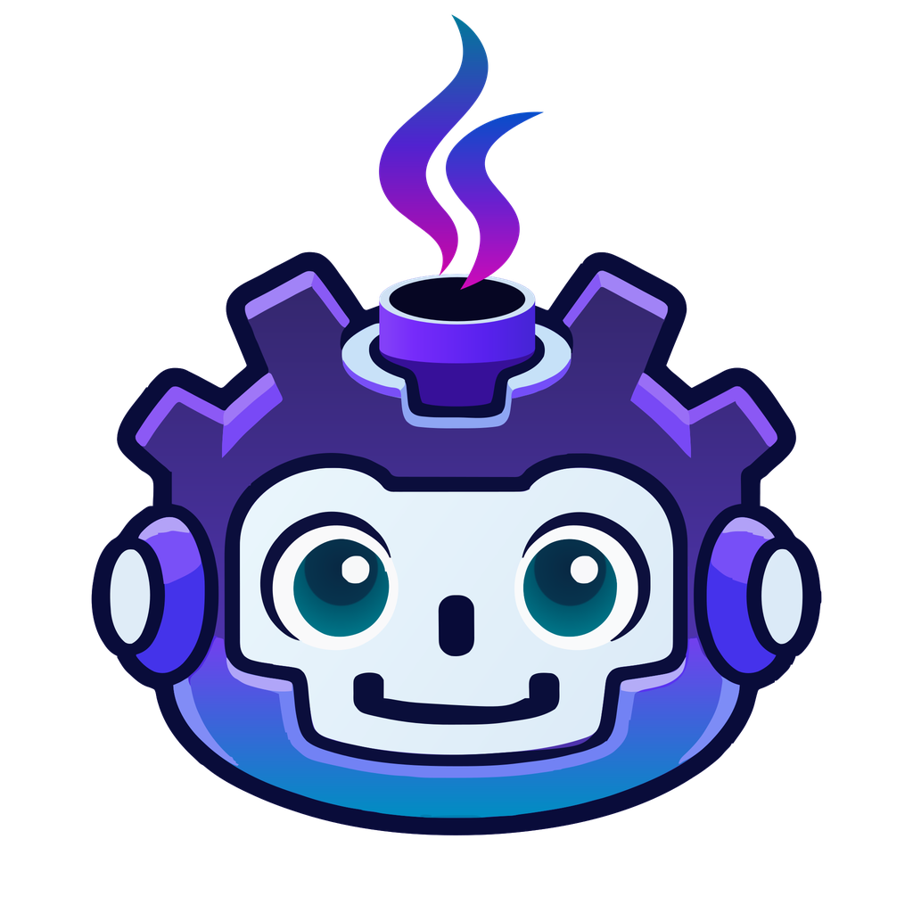

# Godot-JVM
## JVM binding for the Godot Game Engine

## Overview

Godot-JVM lets you write [Godot](https://godotengine.org/) game and application logic in Kotlin, Java, or Scala. Install the GDExtension addon to use the JVM bindings with the official Godot editor and export templates.

Explore these example projects:

- [Godot-JVM project template](https://github.com/utopia-rise/godot-kotlin-project-template)
- [Godot-JVM 3D demo](https://github.com/utopia-rise/godot-kotlin-3d-demo)

### Code Distribution

Distribute desktop games as JARs with an embedded JRE, so players do not need to install Java. Alternatively, compile your JVM code into a native library with the [GraalVM native-image workflow](https://godot-jvm.dev/en/stable/build/export/graalvm-native-image/).

## Status

Godot-JVM 1.0.0 is production-ready. We welcome suggestions and feedback to keep improving the project and its API.

## Install

Use Godot 4.7.2 or newer and JDK 17 or newer. Download the addon archive from the [GitHub releases page](https://github.com/utopia-rise/godot-jvm/releases) and extract it into your project's root directory. The resulting layout must contain `addons/jvm/jvm.gdextension`. Open the project with the release's minimum Godot version or newer.

## Documentation

Follow [Start here](https://godot-jvm.dev/en/stable/start/) to set up a project and run your first script. Continue through the guides for everyday development and the reference for detailed rules and settings.

## Community and contributing

Join us on our [Discord](https://discord.gg/zpb5Ru7v9x) server to ask questions and work together
with a friendly community.

If you want to contribute to the project, please read through the [contribution guidelines](https://godot-jvm.dev/en/stable/contribute/)
and the [setup](https://godot-jvm.dev/en/stable/contribute/build-from-source/) sections.

## Partners

JetBrains supports the project by providing development tools to maintainers. IntelliJ IDEA is the supported IDE for Godot-JVM development.

## Special thanks

Thanks to the [MOE](https://multi-os-engine.org/) community for helping bring Godot-JVM to iOS.
