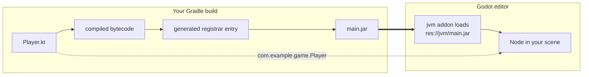
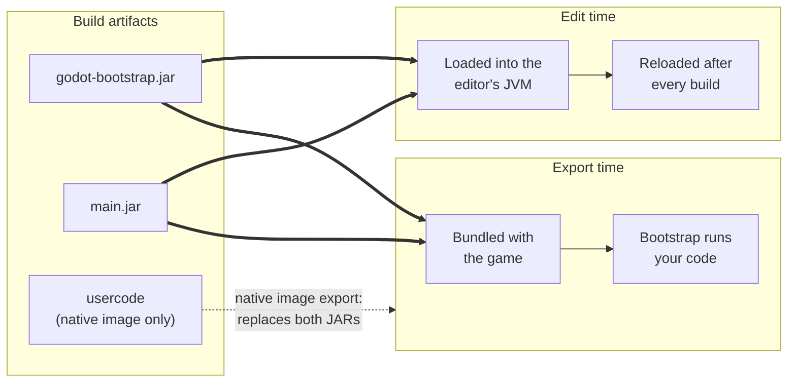

# Where to start

These chapters explain Godot-JVM's internal design and the responsibilities of each component. Read them in order: artifacts and memory management establish the foundation for registration, callbacks, and reloading.

## The path one class takes

You run a Gradle build; your Kotlin, Java or Scala sources are compiled to bytecode, a processor
scans that bytecode for the classes you registered, a registrar is generated from what it finds,
and everything is packaged into two JARs that are copied into `res://jvm/`. The Godot-JVM addon
loads those JARs, and that is how the editor and the running game learn about your classes.

The solid arrows follow compiled code. The dotted arrow shows how the attached source file identifies a class: Godot reads its package and class name, then resolves that fully qualified name to the compiled class in `main.jar`.

The diagram follows a project class attached through its source file. Dependency classes use generated `.gdj` files because their source is outside the Godot project. Both identify compiled classes for Godot to load.

## The three artifacts

1. **[The three build artifacts](artifacts.md)**: what `godot-bootstrap.jar`, `main.jar`, and the
   GraalVM native-image `usercode` output each contain, and when each one is used.
2. **[Memory management](memory-management.md)**: how Godot's object bindings and the JVM garbage
   collector are reconciled, and why `RefCounted` script instances need a weak JNI reference.
3. **[The JNI shared buffer](shared-buffer.md)**: the per-thread buffer used to exchange call arguments and return values, and its memory layout.
4. **[Registration pipeline](registration-pipeline.md)**: how annotated Kotlin, Java, and Scala
   code becomes classes and members Godot knows about.
5. **[Registrar generation](registrar-generation.md)**: how the bytecode processor and the
   registrar generator turn a validated model into registration glue code.
6. **[Signals and callables](signals-and-callables.md)**: the handwritten runtime layer
   underneath signals and callables, and the generated typed arity families above it.
7. **[JAR and script reloading](jar-and-script-reloading.md)**: how the editor reconciles script
   resources with classes from the project JAR after a rebuild.
