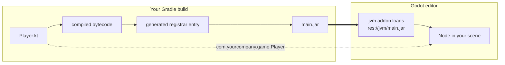

# Where to start

The pages in this section explain the *why* behind Godot-JVM's internals — the engineering
reasoning that user-facing pages deliberately leave out. They are ordered by learning dependency,
not by any writing or importance order: each page builds on ideas from the ones before it.

## The path one class takes

You run a Gradle build; your Kotlin, Java or Scala sources are compiled to bytecode, a processor
scans that bytecode for the classes you registered, a registrar is generated from what it finds,
and everything is packaged into two jars that are copied into `res://jvm/`. The Godot-JVM addon
loads those jars, and that is how the editor and the running game learn about your classes.

The solid path is the code. The dotted arrow is the only thing the attached source file
contributes at that point: Godot reads the package and class name out of it and looks for a class
registered under that fully qualified name. The file is a name tag, not the code being executed —
Godot executes the compiled class that came out of `main.jar`.

This diagram shows a **project class** — one with a source file inside the Godot project, attached
directly as described in [Attaching scripts and .gdj files](../../guide/attaching-scripts.md).
A `.gdj` registration file is *not* part of this path: it only exists for classes that come from a
dependency and have no source file inside the project at all. Project classes never get a `.gdj`;
dependency classes never get attached through a source file. The two mechanisms are mutually
exclusive, not two stages of the same pipeline.

## The three artifacts

1. **[The three build artifacts](artifacts.md)** — what `godot-bootstrap.jar`, `main.jar`, and the
   GraalVM native-image `usercode` output each contain, and when each one is used.
2. **[Memory management](memory-management.md)** — how Godot's object bindings and the JVM garbage
   collector are reconciled, and why `RefCounted` script instances need a weak JNI reference.
3. **[The JNI shared buffer](shared-buffer.md)** — the per-thread buffer that replaces most JNI
   calls between Godot and the JVM, and its memory layout.
4. **[Registration pipeline](registration-pipeline.md)** — how annotated Kotlin, Java, and Scala
   code becomes classes and members Godot knows about.
5. **[Registrar generation](registrar-generation.md)** — how the bytecode processor and the
   registrar generator turn a validated model into registration glue code.
6. **[Signals and callables internals](signals-and-callables.md)** — the handwritten runtime layer
   underneath signals and callables, and the generated typed arity families above it.
7. **[JAR and script reloading](jar-and-script-reloading.md)** — how the editor reconciles script
   resources with classes from the project JAR after a rebuild.
