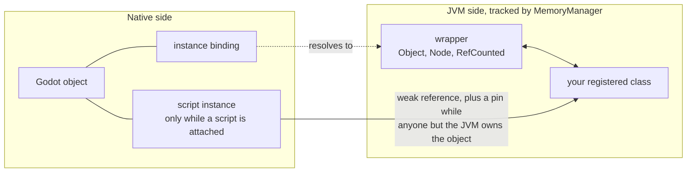
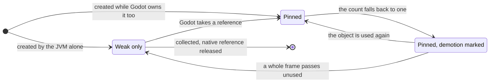

# Memory management

Godot frees an object the moment nothing points at it. The JVM frees an object whenever its collector next gets
around to it. A scripted object lives in both worlds at once, and the binding's whole job is to make the two agree:
keep the object alive while either side still needs it, release it once neither does, and never let the two sides
keep each other alive forever.

## Two runtimes, two rules

**Godot.** An `Object` is freed by hand. A `RefCounted` counts its owners and frees itself at zero. Godot tells a
language binding about the objects it has seen through **instance-binding callbacks**: this one was created, this
one was destroyed, this one's count went up or down.

**The JVM.** The collector reclaims whatever is unreachable, at a time of its own choosing. There is no count to
read and no moment of death to intercept — only the news, afterwards, that something is gone.

That asymmetry is the entire difficulty. Godot's answer is immediate and exact; the JVM's is late and approximate.
Everything below exists to make a late, approximate answer safe for a runtime that expects an immediate, exact one.

## The two JVM halves of a Godot object

A native Godot object can have two representations on the JVM:

- A **wrapper** holds the native pointer and exposes the Godot API. Every object the JVM has ever seen has one.
- A **script instance** is your registered class. Only an object with a script attached has one.

The two are separate because Godot can attach, replace or remove a script while the object lives on. A wrapper that
predates a script must still reach the script instance that appears later, which is why `MemoryManager` tracks both
and resolves a native pointer to whichever one applies.

## The rule everything rests on

**One native reference per JVM wrapper.** However often an object crosses into the JVM, the JVM owns exactly one
reference to it: the first crossing takes it, every later one finds it already taken. So "a wrapper exists" and "the
JVM owns one reference" are the same statement, and the reference is given back when the collector takes the wrapper.

Giving it back is deliberately not immediate, because the collector's report is old news by the time it arrives. In
the gap between a wrapper dying and the binding hearing about it, Godot can hand the same object over again, and that
builds a *new* wrapper which needs a reference of its own. Releasing on the strength of the death report alone would
take the reference out from under it.

So a release takes two synchronizations. At the first, the object is only a **candidate**: the binding notes how many
times it has been delivered so far and does nothing else. At the second, it releases the reference only if the JVM
still has no wrapper for the object and that delivery count has not moved. If either changed, a new wrapper exists,
and it simply inherits the reference that was already there — nothing is released, and nothing new is taken.

That is the whole story for a `RefCounted` with no script attached.

## Scripts: the cycle

A script instance is different, because native code has to be able to *call into it* — a `_process`, a signal
handler, a property write. So the native side holds a JNI reference to it.

Make that reference strong and nothing is ever freed:

- the native object holds the script instance alive, so the collector never takes it;
- the wrapper behind the script instance holds a native reference, so the count never reaches zero.

Each side is waiting for the other. Neither runtime can see the cycle, because neither can see the other's half.

The way out is to notice when the cycle is the *only* thing left. When the native count falls to one, the JVM's own
reference is the last one standing: nothing outside the JVM cares about this object any more. At that point the
native side makes its JNI reference **weak**. The collector is now free to take the script instance, and when it
does, the native reference is released and the object dies. If Godot takes an interest again, the reference is made
strong again first.

Those two moves have names:

- **Promotion** — weak to strong, because someone other than the JVM now owns the object.
- **Demotion** — strong to weak, because the JVM is again the only owner.

Promotion is immediate: the instant Godot holds a reference, the instance must be out of the collector's reach, and
there is no safe moment to be late. Demotion is the opposite — being late only means the object outlives its
usefulness by a moment — so it is queued and carried out at the end-of-frame synchronization, on the main thread,
where it needs no lock against the engine.

## The ping-pong

Run that rule literally and an object in ordinary use pays for it every frame. Godot touches it, which promotes it.
The count falls back to one, which queues a demotion. The frame ends, the demotion runs. Next frame Godot touches
it again and it promotes again.

A full pair of JNI reference operations, every frame, for an object whose situation never actually changed. That is
the ping-pong, and it is the cost the current model is built to remove.

## The pin

The first half of the answer is to stop swapping the reference at all.

A scripted `RefCounted` is **born weak and stays weak for life**. Strength is expressed by a second, ordinary
global reference held *beside* the weak one — the **pin**. Promotion creates the pin. Demotion deletes it. The
reference the rest of the binding reads never changes.

Two things fall out of that. Transitions get cheaper, because creating or deleting one reference is less work than
building a new handle and retiring the old one. And they get safer: the handle other threads read is stable, so
there is no window in which someone can observe it mid-swap.

A plain `Object` has no pin and no weak reference — it is never demoted, so it holds a single strong reference for
as long as the native object lives.

## The deferral

The second half is to stop performing demotions that are about to be undone.

A queued demotion is not acted on the first time the synchronization reaches it. The first pass marks it and leaves
the pin in place. Only a pass that finds it *already* marked removes the pin. And any use of the object clears the
mark.

Read the two arrows out of `Marked` and the behaviour is easy to state:

- An object Godot uses every frame **never loses its pin**. Each use clears the mark, each synchronization sets it
  again, and the demotion never fires. The ping-pong disappears — not by making its two operations cheaper, but by
  not performing them.
- An object that goes quiet is demoted at the first synchronization following a frame in which nobody touched it.

The price is one frame of extra latency for objects that genuinely stop being used. They are collectable a frame
later than strictly necessary, which is invisible against the time the collector takes to notice anyway.

## When a demotion is abandoned

A queued demotion is a statement about the past, and the world can move on before it runs. It is dropped in three
ways:

- **The object was destroyed first.** The queue entry goes with it.
- **It became pointless.** The synchronization re-reads the count and finds it above one again, so someone other
  than the JVM owns the object and the pin has to stay.
- **It lost a race.** The pin is removed, then the count is checked once more. If another thread took a reference
  in that window, the pin goes straight back. The instance is never reachable only weakly while native code still
  holds it.

## Cyclical references between the halves

The wrapper and the script instance refer to each other, and they do not have to appear together. Code can hold a
wrapper long before a script is attached to the same object, and that older wrapper must keep the new script
instance reachable once it exists. `MemoryManager` maintains that link, so a collection cannot take the script
instance out from behind a wrapper that is still in use.
