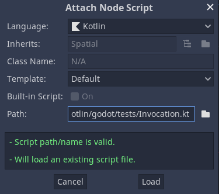

Let's create a file `src/main/kotlin/com/yourcompany/game/Simple.kt` with the following content:

```kotlin
package com.yourcompany.game

import godot.Spatial
import godot.annotation.RegisterClass
import godot.annotation.RegisterFunction
import godot.global.GD

@RegisterClass
class Simple: Spatial() {

    @RegisterFunction
    override fun _ready() {
        GD.print("Hello world!")
    }
}
```

The [classes](../user-guide/classes.md) section covers in detail what we did here, but for now `@RegisterClass` will register the annotated class to Godot so Godot knows our class exists.

!!! note ""
    The plugin automatically generates the registration code which registers your class. We do not recommend that you check these files into source control.
    
Now we can trigger a build.

```shell
./gradlew build
``` 

Once the build completes, you are able to use your scripts in Godot. Simply attach the `kt` files containing registered classes to nodes like you do with GDScript. If you rebuild the project while the editor is open, your classes will be reloaded automatically in Godot and you can use them.



!!! note ""
    As kotlin is a compiled language, you can only use newly created classes after you have built them! Otherwise Godot cannot find them.

## Configuring dependencies
You can use almost the whole jvm ecosystem. Just add a dependency like you would in a normal java based project in the `build.gradle.kts`:

```kotlin
dependencies {
    implementation("joda-time:joda-time:2.10.6")
}
```


## Creating embedded jre
It is recommended that you use an embedded JRE during development. As it is needed for exporting your game anyways, it also makes sense to run on the same jre during development which you use for exporting.  
To create an embedded jre run the following command from the root of your project: `jlink --add-modules java.base,java.logging --output jre`  
If you want to remote debug add the module `jdk.jdwp.agent` to the command.  
If you want to enable jmx, add `jdk.management.agent` to the command.