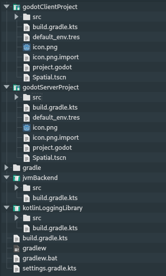
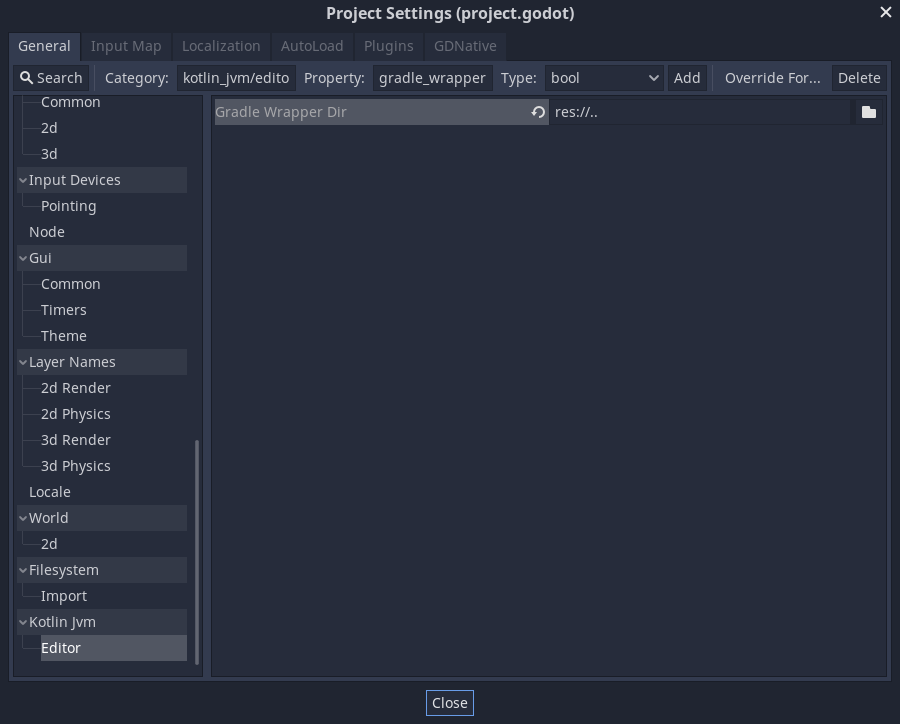

# The godot { } block at a glance

This page is the entry point for configuring `com.utopia-rise.godot-jvm`. Most settings live in the `godot { ... }` block in `build.gradle.kts`; the full property reference is split across the other pages in this section:

- [Languages and toolchains](languages-and-toolchains.md)
- [Registration output](registration.md)
- [Packaging and build tasks](packaging-and-tasks.md)
- [Android, GraalVM and iOS inputs](export-targets.md)

## Quick example

```kotlin
import godot.annotation.processor.classgraph.AnnotationProcessingMode
import godot.gradle.GodotLanguage
import godot.registrar.generator.RegisteredNameMode
import godot.registrar.generator.RegistrationFileLayoutMode

godot {
    languages.set(setOf(GodotLanguage.KOTLIN))
    javaVersion.set(17)
    annotationProcessingMode.set(AnnotationProcessingMode.Inferred)

    godotProjectDirectory.set(file("."))
    disableGdj.set(false)
    registrationFilesDirectory.set(file("gdj"))
    registrationFilesLayoutMode.set(RegistrationFileLayoutMode.FLAT)
    registrationNameMode.set(RegisteredNameMode.SIMPLE_NAME)
}
```

## Recommended Gradle performance settings

For day-to-day project builds, these Gradle properties are a good default:

```properties
org.gradle.parallel=true
org.gradle.configuration-cache=true
```

These are regular Gradle settings, so they belong in `gradle.properties`, not in the `godot { ... }` block.

## Related Gradle and editor configuration

These are often configured together with the plugin, but they are not `godot { ... }` properties.

### Custom source directories

If you want Gradle to compile sources from a non-default Kotlin source directory, configure the regular Kotlin source set:

```kotlin
kotlin.sourceSets.main {
    kotlin.srcDirs("scripts")
}
```

This is standard Gradle/Kotlin source-set configuration.

### Gradle wrapper path in the Godot editor

Sometimes the Godot project is nested inside a larger repository and the Gradle wrapper lives in a parent directory:



In that case, the Godot editor may not find the wrapper automatically because it only looks inside the Godot project directory.

To support that layout, set the Gradle wrapper path from the Godot project settings:


