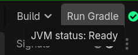

# Create a project

There are three ways to create a new Godot-JVM project: the [IntelliJ IDEA project wizard](#intellij-idea-project-wizard-recommended), the [Godot editor generator](#alternative-generate-from-the-godot-editor), or a [manual Gradle setup](#alternative-set-up-manually).

**Use the IntelliJ IDEA project wizard if you can.** It creates the Godot project, the Gradle build, and the source layout in one action, and opens the result directly in your IDE. The other two routes are here for when the wizard does not fit: the Godot editor generator works from inside an existing Godot project, and the manual route writes the Gradle build by hand for full control over the build or for adding Godot-JVM to an existing Gradle project.

Make sure the [addon is installed](install-the-addon.md) before you start any of the three routes below.

## IntelliJ IDEA project wizard (recommended)

This route creates the entire project in one action and imports it into your IDE. It requires our IntelliJ IDEA plugin.

### Install the plugin

Open IntelliJ IDEA, open **Settings**, select **Plugins**, then select **Marketplace** on the top bar. Type `Godot-JVM` into the search bar, click **Install**, and wait for the IDE to download the plugin. Once the download finishes, press **OK**, then restart IntelliJ IDEA when prompted — a full restart is required to enable the plugin.

### Create the project

1. Open IntelliJ IDEA and click **New Project**.
2. Select **Godot-JVM** from the project type list on the left.
3. Fill in **Name** and **Location**, then the **Default Package** and which languages to enable —
   Kotlin, Java, and Scala are all enabled by default; uncheck any you don't need.
4. (Optional) Expand **Platform Overrides** to configure Android or iOS/GraalVM settings for this
   project.

    

    !!! note "Default platforms"
        Leave both **Platform Overrides** sections unchecked to build for Desktop only. Enabling an
        override adds the files that platform needs; you can also configure this later in
        `build.gradle.kts` — see [Gradle plugin: export-target inputs](../reference/gradle-plugin/export-targets.md).

5. Click **Create**. IntelliJ IDEA creates the project and opens it directly, with the Gradle build
   already synced — no separate "Load Gradle Project" step needed. You will see a `src/main/`
   layout with a folder for each enabled language, `build.gradle.kts`, `settings.gradle.kts`, and
   the Gradle wrapper, ready for [your first script](your-first-script.md). 🚀

    

## Alternative: generate from the Godot editor

??? note "Create the project from inside an existing Godot project"
    You can simply create a regular new Godot project.
    Once done, you can go to `Project/Tools/Kotlin/JVM/Generate JVM project`.

    

    The following choice will appear:
    

    After this action, all required files should be generated, and you can safely import your project in your IDE.

    The generated `build.gradle.kts` keeps the Godot configuration deliberately small:

    ```kotlin
    import godot.gradle.GodotLanguage

    plugins {
        id("com.utopia-rise.godot-jvm") version "<godot-jvm-version>"
    }

    repositories {
        mavenCentral()
    }

    godot {
        languages.set(setOf(GodotLanguage.KOTLIN, GodotLanguage.JAVA, GodotLanguage.SCALA))
        isGodotCoroutinesEnabled.set(true)
    }
    ```

    All other plugin settings use their defaults. See the [Gradle plugin reference](../reference/gradle-plugin/index.md) for an example with every project-wizard option enabled.

    Once the JVM files have been generated, use **Build > Run Gradle** in the Godot editor to build the project. The JVM status indicator changes from yellow to green when the build completes successfully.

    

## Alternative: set up manually

??? note "Write the Gradle build by hand"
    If you do not want to use our IntelliJ IDEA plugin, then you can follow these steps to setup a project.

    !!! note
        The following steps requires Gradle to be installed, checkout their [website](https://gradle.org)
        for installation instructions.

    Firstly, you need to setup a Gradle [wrapper](https://docs.gradle.org/current/userguide/gradle_wrapper.html).
    The wrapper will ensure that anyone who wants to build your project from source will use the same Gradle version.

    /// tab | Windows
    ```shell
    fsutil file createnew build.gradle.kts 0
    fsutil file createnew gradle.properties 0
    fsutil file createnew settings.gradle.kts 0
    ```
    ///

    /// tab | Unix
    ```shell
    touch build.gradle.kts gradle.properties settings.gradle.kts
    ```
    ///

    The above command(s) will create three empty files. As next step, type the following
    command on the terminal:

    ```shell
    gradle wrapper --gradle-version=9.0.0
    ```

    After running the above command, you should have the wrapper setup ready to be used.
    Up next is setting-up the Gradle build. Now, open the `build.gradle.kts` file
    and paste the following content:

    /// tab | `build.gradle.kts`
    ```kotlin
    plugins {
        kotlin("jvm") version "<kotlin-version>"
        id("com.utopia-rise.godot-jvm") version "<godot-jvm-version>"
    }

    repositories {
        mavenCentral()
    }
    ```
    ///

    !!! note
        Replace `<kotlin-version>` and `<godot-jvm-version>` with real version strings before building.
        Use the Godot-JVM version you downloaded the addon for, and a Kotlin version at least as recent as
        the minimum listed in [Compatibility and versions](../reference/compatibility.md).

    The snippet above uses our Gradle plugin. Without the plugin, you have to manually define all needed
    dependencies, manually register the classes, signals, properties, functions and manually create and copy
    the needed JAR's to the appropriate locations.

    For examples of what a Godot-JVM project looks like, see the [project templates and demos](../index.md#project-templates-and-demos) on the Home page.

After setup, create [your first Godot-JVM class](your-first-script.md).
