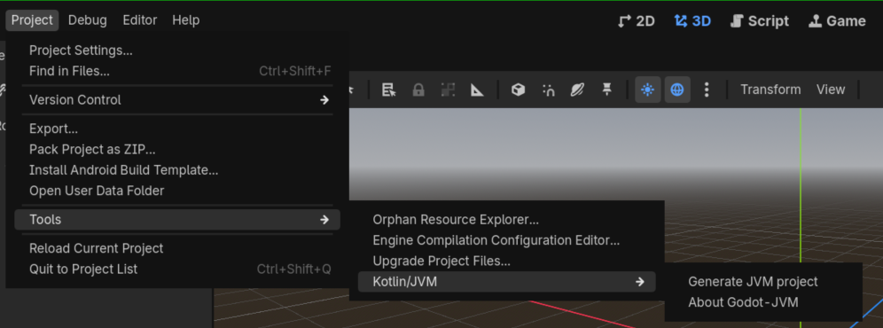
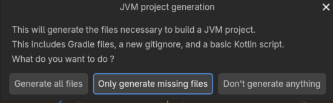
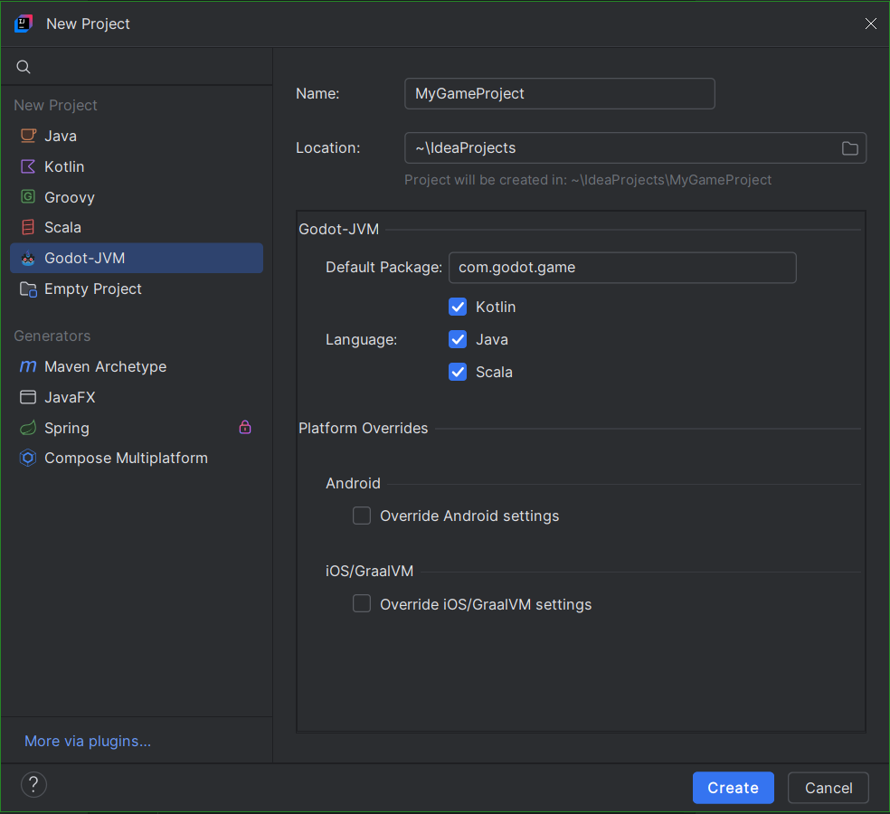
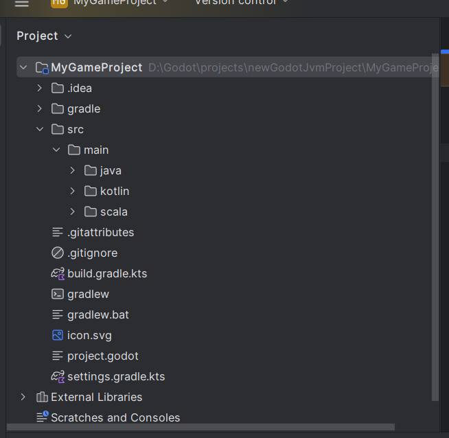

# Create a project

Generate the Gradle build and source directories from the Godot editor.

## Godot editor (recommended)

With your project open and the addon installed:

1. Select **Project > Tools > Kotlin/JVM > Generate JVM project**.

    

2. Review the files the dialog will generate.

    

3. Click **Only generate missing files**, the default button. It adds missing project files and leaves existing files in place.
4. Open the generated project in IntelliJ IDEA to edit your scripts.

!!! warning
    **Generate all files** overwrites existing generated project files. Use **Only generate missing files** to preserve your build configuration.

The Godot-JVM Gradle plugin applies Kotlin automatically; you do not need a separate Kotlin plugin declaration.

## IntelliJ IDEA wizard

Use the wizard when you want to create a new project from IntelliJ IDEA.

Install the **Godot-JVM** plugin in **Settings > Plugins > Marketplace** (listed under its previous name, Godot Kotlin/Jvm, until the 1.0.0 plugin release). Restart the IDE if prompted.

1. Choose **New Project > Godot-JVM**.
2. Enter **Name**, **Location**, and **Default Package**, then choose the languages to enable. Kotlin, Java, and Scala are enabled by default.
3. Leave **Platform Overrides** unchecked for this desktop walkthrough.
4. Click **Create** to generate the Godot files, Gradle build, wrapper, and source directories.
5. Extract the addon into the new directory so it contains `addons/jvm/jvm.gdextension`.

!!! warning
    Choose a new directory. The wizard overwrites files such as `project.godot`, `icon.svg`, and Git configuration files; do not use it on an existing Godot project.

## Template project

You can also start from the [Godot-JVM project template](https://github.com/utopia-rise/godot-kotlin-project-template) in the Utopia Rise GitHub organization. Copy it, then install the addon version that matches the Gradle plugin version in its `build.gradle.kts`. The template's README still describes the older custom-engine setup; for Godot-JVM 1.0.0, prefer the editor generator.

The next page explains the project layout before you write your first script.
