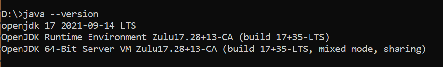

# Install a JDK

To use Godot-JVM, at least JDK 17 is needed. You need the JDK, not only the JRE: the JRE only *runs* Java programs, while the JDK also contains the compiler and tooling needed to build your game's code. Godot needs to be able to find that JDK, which it does either through the `JAVA_HOME` environment variable or through a `java` executable on your `PATH` — you only need to set up one of the two.

We recommend the [Eclipse Temurin](https://adoptium.net/) builds of OpenJDK.

!!! warning
    Avoid the Microsoft build of OpenJDK: it ships without the `Packages` folder that the IntelliJ IDEA plugin build expects, which makes the build fail (see [microsoft/openjdk#339](https://github.com/microsoft/openjdk/issues/339)). If you must use it, create an empty `Packages` folder inside your `JAVA_HOME` manually.

To check your installation, run `java -version` and `javac -version` (or the equivalent `--version`)
— both must report 17 or newer. The vendor name in the output (Temurin, Zulu, or otherwise) does not
matter; the version number does.



If `java` resolves on your `PATH` (the version check above already confirms this), you're done —
no `JAVA_HOME` needed. To use `JAVA_HOME` instead, or to check what it's currently set to: `echo
$JAVA_HOME` on macOS and Linux, or `echo $env:JAVA_HOME` in Windows PowerShell.

!!! note "If both are set to different JDKs"
    `PATH` takes priority over `JAVA_HOME`. If you have an older JDK on `PATH` and a newer one in
    `JAVA_HOME`, Godot uses the one on `PATH` — update `PATH` rather than `JAVA_HOME` if that's not
    the JDK you want.

## Mac

You can install Java via [homebrew](https://brew.sh/). Once you installed it, you can run `brew install --cask temurin@21` to install the Temurin LTS version of Java. If you want to pick a different version, you can run `brew search jdk`.

!!! warning
    On macOS apps started from the GUI cannot see environment variables from bash or zsh, only command line apps can. Set environment variable using launchctl.
    ```shell
    launchctl setenv JAVA_HOME pathtoyourjava
    ```

## Linux

You can install Java via your distributions package manager.

## Windows

You can install Java via [Chocolatey](https://community.chocolatey.org/). For example, to install the Temurin LTS build you can run `choco install temurin21`. AdoptOpenJDK was renamed to Eclipse Temurin, so the old `adoptopenjdk*` packages are no longer maintained. You can also grab an installer directly from the [Adoptium download page](https://adoptium.net/temurin/releases/).
