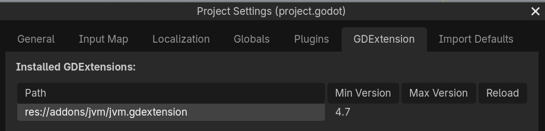

# Install

Install a JDK, then add the addon to your Godot project.

## Install a JDK

Install JDK 17 or newer; [Eclipse Temurin](https://adoptium.net/) is recommended. The JDK includes the runtime and tools needed to build your code.

/// tab | macOS
With [Homebrew](https://brew.sh/) installed, run:

```shell
brew install --cask temurin@21
```
///
/// tab | Linux
Install a JDK through your distribution's package manager, or use a [Temurin build](https://adoptium.net/temurin/releases/) for your distribution.
///
/// tab | Windows
Use an installer from [Adoptium](https://adoptium.net/temurin/releases/), or install with [Chocolatey](https://community.chocolatey.org/):

```shell
choco install temurin21
```
///

### Verify the installation

Open a new terminal and run:

```shell
java -version
javac -version
```

Both commands must report version 17 or newer.


### Make the JDK visible to the editor

Make the JDK available through `PATH` or set `JAVA_HOME` to its installation directory. Check `JAVA_HOME` with `echo $JAVA_HOME` on macOS or Linux, or `echo $env:JAVA_HOME` in Windows PowerShell.

!!! note "Which JDK the editor uses"
    The editor looks for a JVM in this order: the embedded JRE under `jvm/`, on macOS the JDK reported by `/usr/libexec/java_home -v 17+`, the first usable `java` on `PATH`, then `JAVA_HOME`. Exported games use only the embedded JRE.

On macOS, the editor opened from Finder or the Dock does not inherit your shell's environment variables. Set `JAVA_HOME` for the editor, replacing the path with your JDK's home directory:

```shell
launchctl setenv JAVA_HOME /path/to/jdk/Contents/Home
```

## Install the addon

Download `godot-jvm-addon-<version>.zip` from [GitHub releases](https://github.com/utopia-rise/godot-jvm/releases) and extract it at your Godot project's root. Preserve the archive's `addons` directory so the manifest is at:

```
<project root>/addons/jvm/jvm.gdextension
```

Open the project in Godot `4.7.2` or newer, then select **Project > Project Settings > GDExtension**. Confirm that `res://addons/jvm/jvm.gdextension` is listed and enabled.



The addon is installed. Next, generate the Gradle project from the editor.
