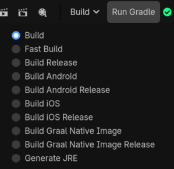
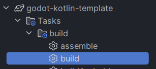

# Your first script

!!! note "Before you attach anything"
    A JVM class only exists for Godot once a Gradle build has **succeeded**.
    The JVM status indicator in the Godot editor toolbar tells you where you
    stand: it is yellow while the JVM is still starting or your code has not
    been loaded yet, and it turns green once your classes are loaded. Build
    with **Build > Run Gradle** in the editor, from your IDE, or from a
    terminal.

Let's create a class that prints a message when its node enters the scene
tree.

/// tab | Kotlin

Create `src/main/kotlin/com/yourcompany/game/Player.kt`:

```kotlin
package com.yourcompany.game

import godot.annotation.Script
import godot.api.Node
import godot.global.GD

@Script
class Player : Node() {
    override fun _ready() {
        GD.print("Hello from Kotlin")
    }
}
```

///

/// tab | Java

Create `src/main/java/com/yourcompany/game/Player.java`:

```java
package com.yourcompany.game;

import godot.annotation.Script;
import godot.api.Node;
import godot.global.GD;

@Script
public class Player extends Node {
    @Override
    public void _ready() {
        GD.print("Hello from Java");
    }
}
```

///

/// tab | Scala

Create `src/main/scala/com/yourcompany/game/Player.scala`:

```scala
package com.yourcompany.game

import godot.annotation.Script
import godot.api.Node
import godot.global.GD

@Script
class Player extends Node {
  override def _ready(): Unit = {
    GD.print("Hello from Scala")
  }
}
```

///

This small example already shows the main building blocks:

- `@Script` makes the class available to Godot.
- Inheriting `Node` makes it a Godot script class.
- Overriding `_ready()` runs code when the node enters the scene tree.
- `GD.print(...)` writes to the Godot output.

## Build it

To compile your project, run a classic *Gradle build*. By default this creates a `debug` version of your code.

Using the Godot editor:



!!! warning
    On Linux or macOS you may receive an error when trying to build the project from the Godot editor (This can happen if you created your project via the IntelliJ template).
    ```shell
    ERROR: Godot-JVM: Could not create child process: /Users/username/projectname/gradlew
    ERROR:  at: execute_with_pipe (drivers/unix/os_unix.cpp:659)
    ```

    In such case, open up the terminal and change the permissions of the `gradlew` file to be executable.
    ```shell
    chmod +x gradlew
    ```

Using your IDE:



Using command-line:

/// tab | Windows
```shell
gradlew build
```
///

/// tab | Unix
```bash
./gradlew build
```
///

## Attach it to a node

After the build, attach the source file (`Player.kt`, `Player.java`, or
`Player.scala`) to a node the same way you would attach a GDScript file —
usually by dragging it from the FileSystem panel onto the node. You can also
use the **Attach Node Script** dialog (right-click the node ▸ **Attach
Script**); it works exactly like it does for GDScript, see Godot's own
[Creating your first script](https://docs.godotengine.org/en/stable/getting_started/step_by_step/scripting_first_script.html)
page. Name the file after the class, as in the example above (`Player.kt`
declares `Player`) — see [Attaching scripts](../guide/attaching-scripts.md)
for exactly when that naming actually matters.

If you rebuild while the editor is open, your classes are reloaded
automatically.

!!! info
    JVM languages are compiled. Godot cannot use a newly created or changed
    class until its build succeeds.

!!! warning "If you attach the file before a successful build"
    Godot will still let you attach it, but there is no compiled class behind it
    yet, so the editor keeps a best-effort placeholder instead. The node shows a
    script, but it exposes none of your properties or methods, and `_ready` never
    runs — not in the editor and not when you play the scene. Nothing is broken:
    run the build, and the placeholder is replaced by the real class.

    If you see a node with a script and no members, this is almost always why.

Once this class works, [Write your game](../guide/index.md) covers the rest: signals, properties,
exporting to the Inspector, and registration in full.
